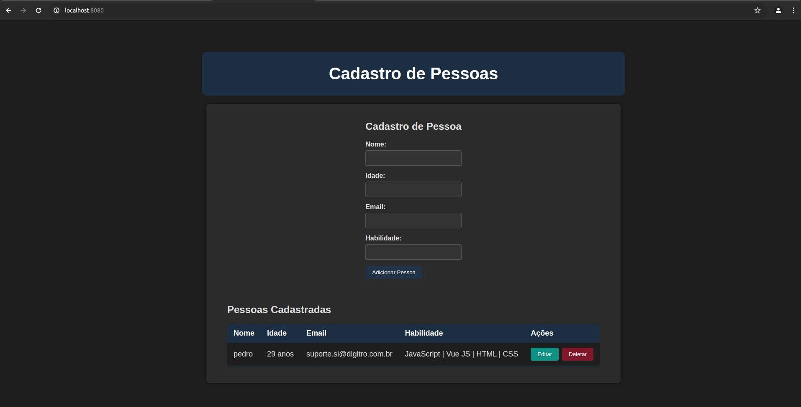

# Vue.js CRUD App

Este é um aplicativo de CRUD simples construído com Vue.js.

## Visão Geral

O aplicativo permite que os usuários cadastrem pessoas, visualizem a lista de pessoas cadastradas, editem e deletem registros. Ele demonstra o uso de componentes Vue, manipulação de dados e estilo CSS.

## Screenshot



## Funcionalidades

- Adicionar novas pessoas
- Editar informações das pessoas cadastradas
- Deletar registros de pessoas
- Visualizar uma lista de pessoas cadastradas em uma tabela estilizada

## Tecnologias Usadas

- [Vue.js](https://vuejs.org/) - Framework JavaScript para construção de interfaces de usuário
- HTML5
- CSS3

## Instalação

1. Clone o repositório para o seu ambiente local:
    ```sh
    git clone https://github.com/SEU_USUARIO/vue-crud-app.git
    ```

2. Navegue até o diretório do projeto:
    ```sh
    cd vue-crud-app
    ```

3. Instale as dependências do projeto:
    ```sh
    npm install
    ```

## Uso

1. Inicie o servidor de desenvolvimento:
    ```sh
    npm run serve
    ```

2. Abra o navegador e acesse `http://localhost:8080` para ver o aplicativo em ação.

## Contribuição

Contribuições são bem-vindas! Sinta-se à vontade para abrir uma issue ou enviar um pull request.

## Licença

Este projeto está licenciado sob a Licença MIT. Veja o arquivo [LICENSE](LICENSE) para mais detalhes.
